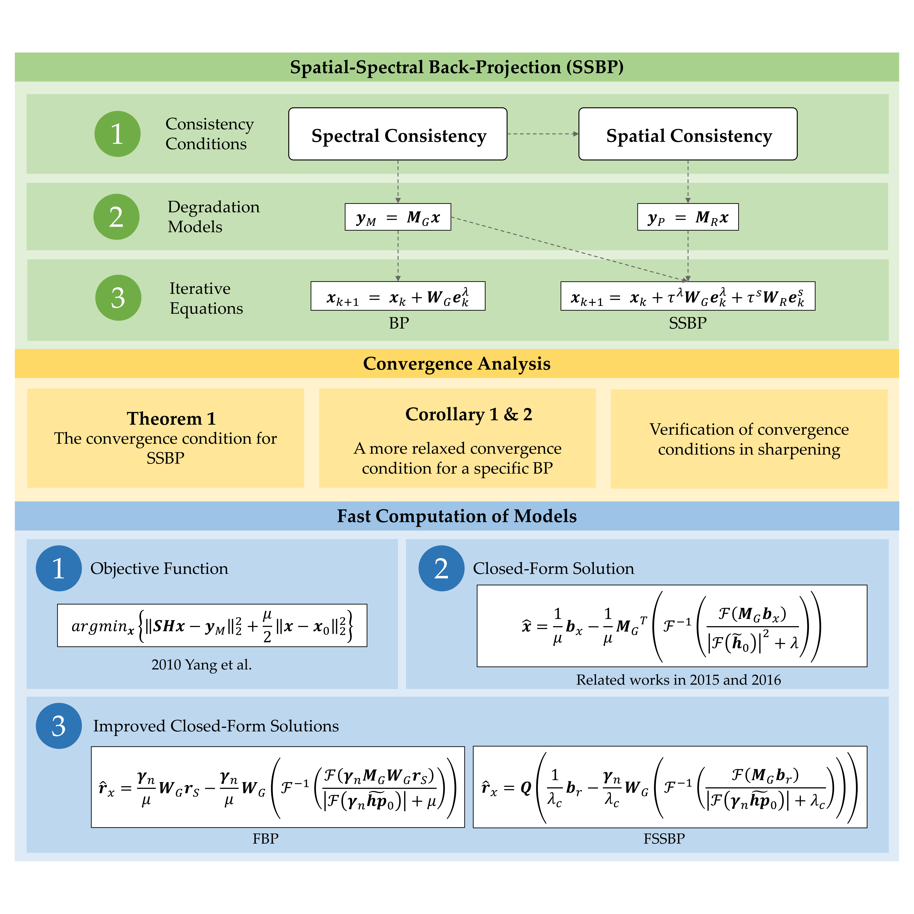

## **FSSBP: Fast Spatial-Spectral Back Projection Based on Pan-sharpening Iterative Optimization, 2023.**

**This repository contains 3 demo programs and the datasets used in the paper.**

### Usage

+ Please add all subfolders of the source code to the matlab search path and execute the m-file in the root directory for the demo: 

  (1) *FSSBP_demo.m*: Demonstration of BP_I, BP_T, SSBP, FBP and FSSBP.

  (2) *C_BP_plot_demo.m*: Plot C_BP values for common sharpening interpolators to verify convergence.

  (3) *M_matrix_calculation_demo.m*: Demonstration of the BP transformation matrix and its spectral radius calculation.

+ If you want to run BP alone, please refer to *FSSBP_demo.m* and call *init_BP_options*, *generateDefaultSensorInf*, *BP_Wrapper* functions as needed.

### Other Notes

+ The data and some third-party tools or functions contained in the code package should be copyrighted to the corresponding authors and organizations.

+ If this code is helpful to your work, please cite our paper: https://doi.org/10.3390/rs15184543.

+ For questions, please contact: blueuranus@qq.com.
